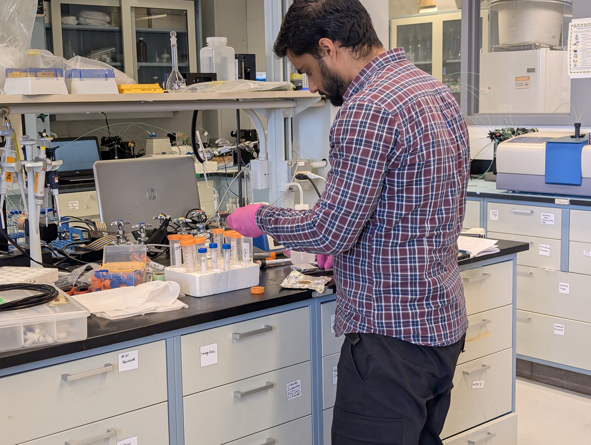

# alokthakur.github.io

## Projects

### Development of low-cost air quality monitor
•	I used the Arduino set-up integrated with the low-cost sensor (LCS) Plantower PMS5003 sensor, RTC clock DS 3231, microSD card module, and ESP01 module for Wi-Fi connection. 
•	The device is capable to store the data offline as well as data visualization through the Thingspeak server. 
•	The sensor assembly is powered with the help of a power bank (5 W) or through AC/DC adapter (9V/1A). 
•	The compactness of the current sensor assembly will be achieved with 3D printing cases and PCBs to make it more durable and efficient. 
•	Few of the in-house developed AQMs use a datashield logger (inbuilt RTC and microSD module) for offline data storage.

### Indoor Air Quality in Urban India: Current Status, Research Gap, and the Way Forward
•	Critically reviews the research on the measurement, modeling, and mitigation (3Ms) of IAP in developed nations and India
•	Lack of state-of-the-art instrumentation for comprehensive characterization, reporting a limited number of pollutants, etc., to be a few bottlenecks in existing indoor studies
•	Fundamental studies on sources, transport, transformation, and the fate of pollutants in urban indoor spaces are nearly non-existent
•	Few recommendations, like proper resource allotment to IAP studies, devising regulatory guidelines, etc., to be a few initial steps for better IAP research

Published in Environmental Science and Technology Letters (https://doi.org/10.1021/acs.estlett.3c00636)

### Insights into Low-cost PM Sensors Using Size-resolved Scattering Intensity of Cooking Aerosols in a Test House
•	Critically reviews the research on the measurement, modeling, and mitigation (3Ms) of IAP in developed nations and India
•	Lack of state-of-the-art instrumentation for comprehensive characterization, reporting a limited number of pollutants, etc., to be a few bottlenecks in existing indoor studies
•	Fundamental studies on sources, transport, transformation, and the fate of pollutants in urban indoor spaces are nearly non-existent
•	Few recommendations, like proper resource allotment to IAP studies, devising regulatory guidelines, etc., to be a few initial steps for better IAP research

Published in Aerosol Science & Technology (https://doi.org/10.1080/02786826.2024.2342722)

### Characterization of IAP in Multi-zonal Residential Apartment: Transport, Exposure, and Mitigation 
•	Spatio-temporal monitoring in a multi-zonal residential apartment in-house low-cost air quality monitors.
•	Pollutants took relatively less time to reach zones with installed ACs (BRs) during AC operation than in the 'w/o AC' scenario.
•	Exposure in all zones relative to the kitchen ranged between ~0.8-0.9, indicating that occupants in and away from the emissions zone (kitchen) have comparable exposure.
•	AC operation reduced cumulative relative exposure, which was further reduced upon affixing a filter sheet on the AC pre-filter.
•	Increased filtration efficiency due to the added filter sheet on PAC was negated by the reduced flow rate.

Published in Environmental Science: Atmospheres https://doi.org/10.1039/D4EA00080C

### Predicting Spatio-temporal Concentrations in a Multizonal Residential Apartment Using Conventional and Physics-Informed Deep Learning Approach
•	Multi-zonal PM2.5 and CO2 prediction in an apartment using LSTM and PI-LSTM models.
•	PI-LSTM outperformed LSTM for PM2.5, while LSTM showed better accuracy for CO2.
•	PI-LSTM accuracy declined as more zones were added by opening internal doors.
•	PM2.5 predictions were more accurate for zones nearer to the emission source.

Submitted in ES&T Air

### Predicting Spatio-temporal Concentrations in a Multizonal Residential Apartment Using Conventional and Physics-Informed Deep Learning Approach
•	Multi-zonal PM2.5 and CO2 prediction in an apartment using LSTM and PI-LSTM models.
•	PI-LSTM outperformed LSTM for PM2.5, while LSTM showed better accuracy for CO2.
•	PI-LSTM accuracy declined as more zones were added by opening internal doors.
•	PM2.5 predictions were more accurate for zones nearer to the emission source.

### CFD modeling of natural and mechanical ventilation in an average Indian household
•	Development of a custom solver to model pollutant transport in a residential apartment
•	Effect of various ventilation methods on the exposure inside the apartment
•	Further cases to be run by closing and opening internal doors

### Particle Capture using Incense Cap
•	The current works explore the possibility of using a cap to reduce exposure from ultra-fine particles emitted from incense sticks and mosquito coils.
•	The cube cap (5 x 5 x 5 cm) with parallel narrow 2 mm channels is 3D printed, and initial experiments are conducted to see the efficacy of the cap.

## Education
Ph.D. IIT Gandhinagar
M.Tech. IIT Gandhinagar
B.Tech. Uttarakhand Technical University

## Work history
JRF @ IIT Gandhinagar

